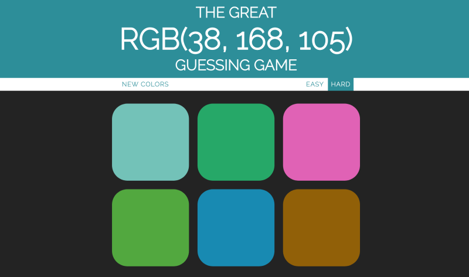

# Opgave 1 - Del 3

De næste par delopgaver handler om at lave et spil. Vi kalder det "ColorGuesser.

Spillet handler om at spilleren får givet en tilfældig farvekode. Dernæst bliver der vist et antal firkanter i et gitter, hvoraf en af dem har den rigtige farve og de andre har nogle tilfældigt genererede farver som på billedet nedenfor: 

## Opgavebeskrivelse
Lav en hjemmeside, hvor du kan generere en tilfældig farve (dette bør du have lavet i del 1 og 2). Lav også et design med forskellige firkanter samt et sted, hvor du kan skrive farvekoden, der skal gættes. 

Der er ingen hints til denne opgave og du bestemmer selv omfanget.